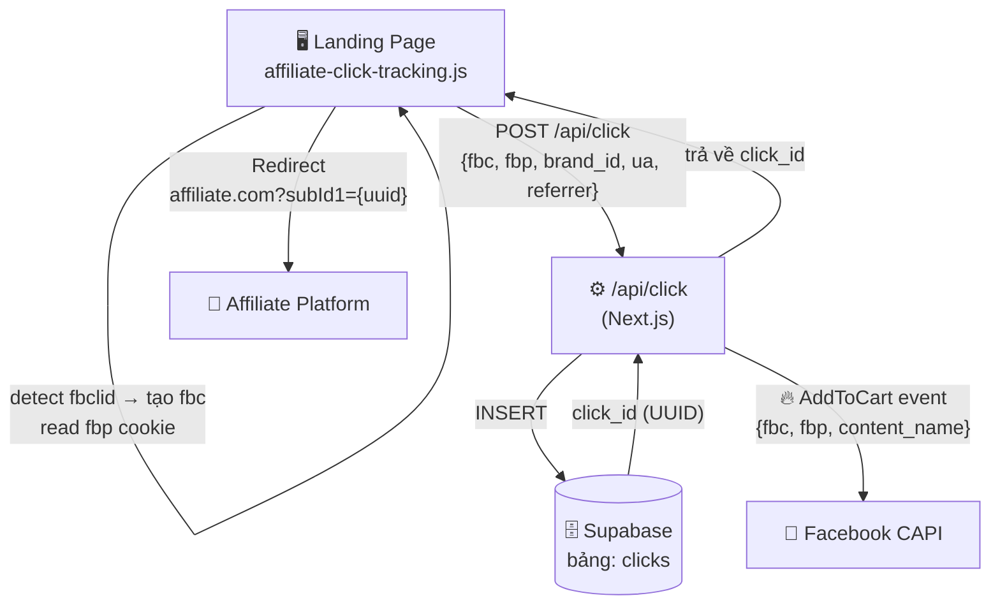
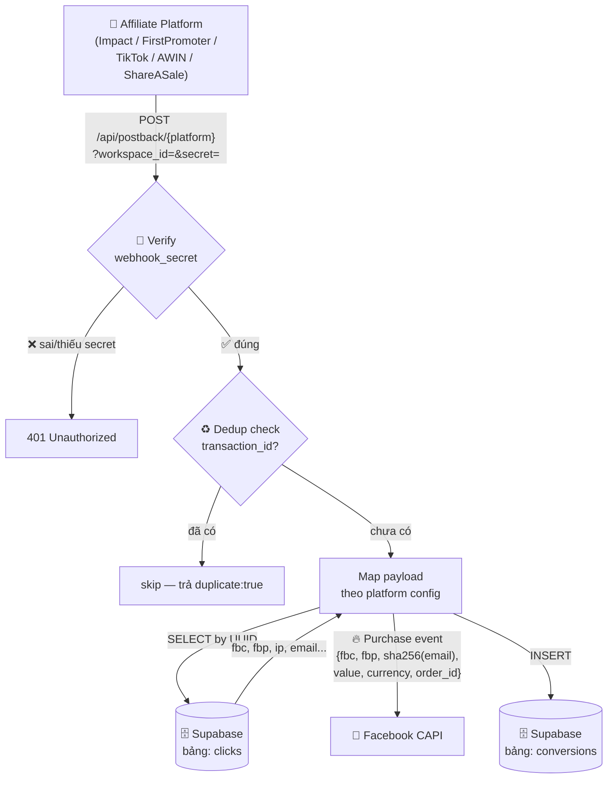
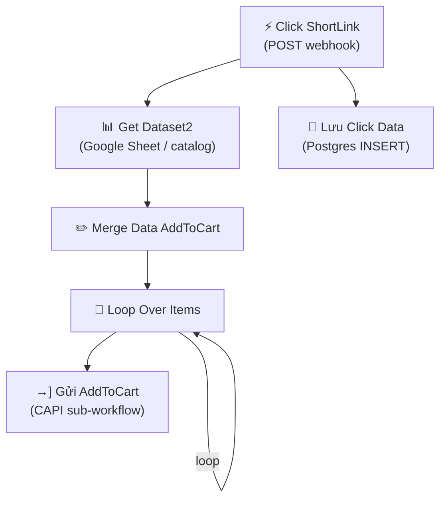
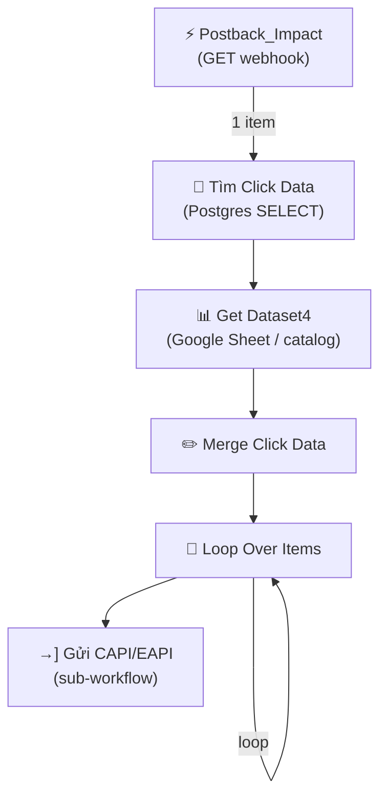

# So sánh: tracking-saas vs n8n Workflow

---

## Flow tracking-saas (hệ thống hiện tại)

### Workflow 1 — Click Tracking



### Workflow 2 — Postback & Conversion



---

## Flow n8n (workflow tham chiếu)

### Workflow 1 — Click



### Workflow 2 — Postback



---

## So sánh trực tiếp

| Tiêu chí | tracking-saas | n8n |
|----------|--------------|-----|
| **Trigger click** | POST `/api/click` | POST webhook |
| **Lưu click** | Supabase (managed, có RLS) | Postgres tự host |
| **Event khi click** | ✅ AddToCart CAPI | ✅ AddToCart CAPI |
| **Trigger postback** | POST/GET `/api/postback/:platform` | GET webhook |
| **Match click ↔ conversion** | UUID trong `subId1` → lookup `clicks.id` | UUID trong Postgres |
| **Bảo vệ postback** | ✅ `webhook_secret` verify | ❌ không có |
| **Dedup conversion** | ✅ check `transaction_id` | ❌ không rõ |
| **Dataset merge** | ✅ content_ids + content_category per project | ✅ Get Dataset2/4 (catalog) |
| **Event khi conversion** | ✅ Purchase CAPI | ✅ CAPI |
| **EAPI (email platform)** | ✅ Klaviyo (Placed Order event) | ✅ CAPI + EAPI |
| **Multi-tenant** | ✅ workspace per user | ❌ 1 workspace cố định |
| **Auth dashboard** | ✅ Supabase Auth | ❌ không có |
| **Platform config** | ✅ 6 platforms + custom | ✅ Impact (cố định) |
| **Deploy** | Vercel (serverless) | Self-hosted / cloud |

---

## Kết luận

Hệ thống **tracking-saas bao phủ đầy đủ core flow** giống n8n và đã **vượt trội toàn diện**:

```
click → lưu UUID → affiliate → postback → match UUID → Purchase CAPI + Klaviyo
```

| Lợi thế so với n8n | Chi tiết |
|--------------------|---------|
| Bảo mật postback | `webhook_secret` per workspace — n8n không có |
| Dedup conversion | Check `transaction_id` trước khi xử lý |
| Multi-tenant | Nhiều user, mỗi user có workspace riêng |
| 6 platform configs | FirstPromoter, Impact, PartnerStack, AWIN, ShareASale, TikTok + custom |
| Dashboard có auth | Login, workspace settings, project management |
| Content IDs / catalog | `content_ids[]` + `content_category` per project → enriched CAPI payload |
| Klaviyo EAPI | `Placed Order` event song song với Facebook CAPI |
| FB CAPI + Klaviyo parallel | Dùng `Promise.all` — không blocking lẫn nhau |
